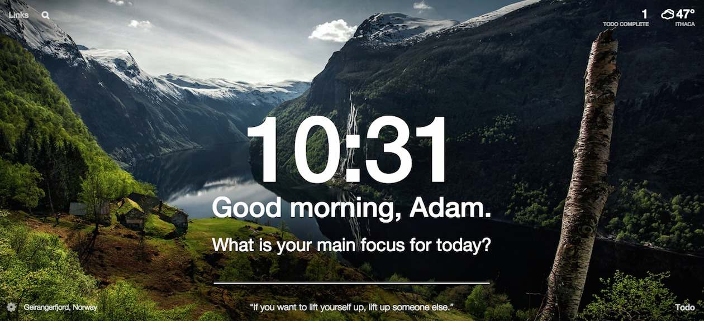

# momentum-clone  

- [Deploy](https://filonushka.github.io/momentum-clone/)  
- Tech Stack:
  - HTML
  - CSS
  - JS  

- Functionality:  
  - clock and calendar  
  - greeting  
  - image slider  
  - weather widget  
  - quote of the day widget  
  - audio player  
  - get background image from API  
  - setting focus for the day  
  - todo app
- The example:  

